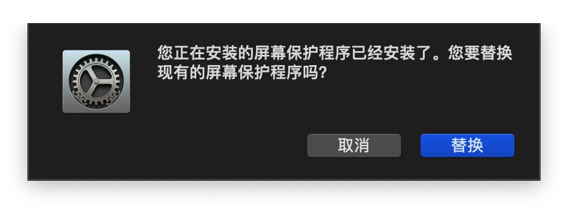
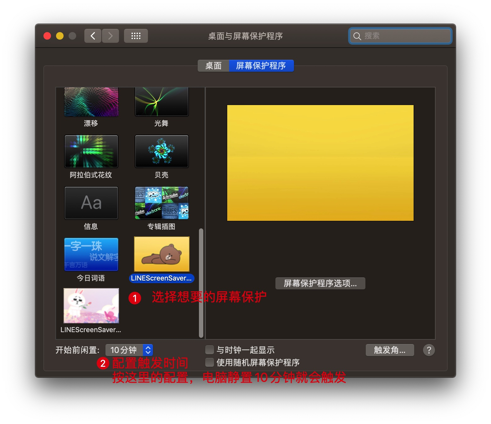

# 简略教程

按照操作系统下载对应的安装包，进行安装即可。

# 详细教程

## Windows平台

[Win7之家：主编教您win7屏幕保护如何设置](http://www.windows7en.com/jiaocheng/46945.html)

[Win8系统之家：Windows8电脑怎么设置屏保？](http://www.win8.net/jiaocheng/20170106/6847.html)

[系统之家：Win10怎么设置屏幕保护？Win10设置屏幕保护的方法](http://www.xitongzhijia.net/xtjc/20190104/146568.html)

## macOS

下载后双击zip压缩包解压，再双击解压出来的`LINEScreenSaverCony.saver`屏保程序，会自动弹出安装。

安装完之后会提示你选择屏保。

想要更换屏保，可以在桌面点击右键，选择“更改桌面背景”，即可进入安装时弹出的页面。

## 手机端与Linux系统

手机端与Linux系统没有这个屏幕保护程序可以使用。

### 如果你安装成功，我希望你可以阅读一下[关于](/about)。